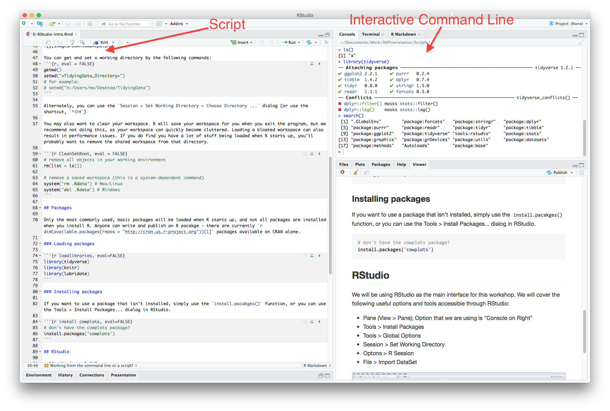
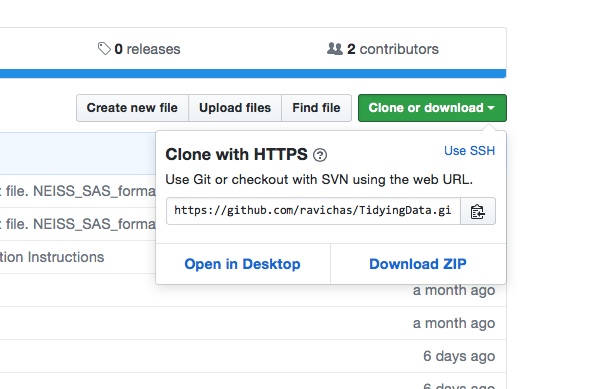
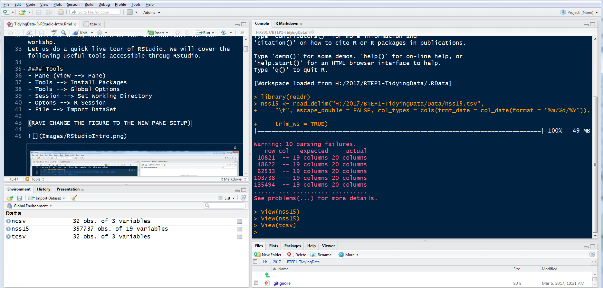

```{r setup, include=FALSE}
knitr::opts_chunk$set(echo = TRUE)
library(tidyverse)
library(knitr)
library(lubridate)
```

If you would like to see some additional examples, take a look at the R/RStudio Intro section of [Examples.R](https://raw.githubusercontent.com/ravichas/TidyingData/master/Examples.R)

# R basics

## What is R?

- R is a statistical computing environment
- R is a dynamic programming language
    - Does not need compilation (languages such as C, modern FORTRAN, Java... require compilation)

## Availability 

- Base R and R core packages can be downloaded from Comprehensive R Archive Network (CRAN)
    - cran.r-project.org 
- Available in Windows/Linux/Mac
- RGUI/RStudio
- There are other repositories (e.g. Bioconductor and GitHub), but we won't cover these in detail today.

## Working from the command line or a script?

There is a big difference between working interactively from the command line and running saved commands from a script. A script allows you to save your work and reproduce your analysis, exactly.



## Data types

There are seven basic data types in R. The last two are not usually relevant to our work, and we will not discuss them further.

- integer: counting numbers
    - `as.integer(1:10)`
- numeric (equivalent to a double): real numbers (or something close to real numbers)
    - `1:10 / 10`
- character: for text
    - `letters[1:10]`
- logical: TRUE or FALSE values. When converting numeric valued to logical values, `0` is FALSE and any non-zero value is TRUE.
    - `1 == 2`
- factor: Factors in R are a little different from the traditional data types in other languages. A factor is stored as an integer value that is mapped to a set of character labels. There are some advantages to this that are beyond our scope, but usually it is best to store these as character values.
    - `as.factor(letters[1:10])`
- complex: complex numbers
- raw: raw bytes of information

### Non-numeric values

There are also some non-numeric values that you will run across. These are nice to have around, because sometimes you get unexpected results when working with messy data. You would really like the analysis to continue on without choking every time you divide by 0 (which happens more often than you might expect).

R will warn you when non-numeric values are generated, but it will continue on - usually ignoring any non-numeric results. Pay attention to these warnings, because they can be a sign that something is wrong.

- NA: used to encode missing data in R
- Inf/-Inf: used to encode infinite values
- NaN: used to encode "not a number" (e.g. 0/0)

## Data objects

There are five basic data objects in R.

- vector: a column of data values.
- matrix: a matrix containing rows and columns of data values.
- array: a higher dimensional array of data values. Arrays are typically not needed for statistical analysis.
- list: a collection of data objects, possibly named. Lists can be used to construct more complicated data structures.
- data.frame: a special case of a list, where each element is a vector of equal length, and each row is associated with a specific observation.

### Working with vectors

Here are some examples of vectors and vector operations.


```{r vectors}
# working with a vector of length 1
aa <- 22.7

aa + 2
sqrt(aa+1)
aa/3

# working with a vector with multiple elements
ages <- 1:4
ages <- c(1,2,3,4) # another way to create vectors (results in the same vector)

ages + 3   # ages of kids after 3 years
```

You can't mix data types within a vector. Trying to force different data types together into a single vector will result in some data being coerced into a different data type, often with unexpected results.

```{r vector coersion, error=TRUE}
# here R politely coerces everything to be a character - no data loss
x <- c(1:3, '4', 'A', 'b', 3)

# error: we can't add numbers to characters
x + 4

# try to force the addition above to work - we loose data
as.numeric(x) + 4
```

### Variables

What are acceptable and non acceptable variable names in R?

- Variable names should start with a character (i.e. not a number, underscore, etc.). Exception: variable names can start with a '.', and these variables will not be listed in the output of `ls()`.
- Numbers, underscores, and dots are accepted within variable names
- Spaces are not accepted within variable names, but they may be used judiciously in variable attributes (e.g. column names). You need to be careful about how you do this.

```{r echo = FALSE, results = 'asis'}
No <- c("1run", "b$", "^mean", "!var1", "x 1", "_x")
Yes <- c("run1", "b" ,  "mean",  "var1", "x_1", ".x")
df <- data_frame(Acceptable = No, Unacceptable = Yes)
kable(df, caption = "Acceptable (Yes) and non-acceptable (No) Variable Names")
```

Variable names are case-sensitive, and they can be over-written.

```{r}
var1 <- 2
VAR1 <- 1 
var1 + VAR1
(var1 <- 100) # overwrite 
```

Be careful when creating variables with the same name as variables that already exist!

```{r conflicts1}
# replace sum() with prod()
sum <- function(x) prod(x)

sum(1:4)
base::sum(1:4) # we can still recover the original functionality
```

You can also do some odd things... this leads to confusion and is best avoided.

```{r conflicts2}
sum <- 1:4

sum(sum)

# probably don't want to leave this lying around
rm(sum)
```

### Indexing data objects

Here we have the same table of data in three different data objects (a matrix, a data_frame and a list). We can get to the data inside of each of these objects as follows:

```{r 3 data objects}
# our table as a matrix
(mat <- matrix(1:12, nrow = 3, 
               dimnames = list(letters[24:26], letters[1:4])))

# our table as a data_frame
(df <- data_frame(id = letters[24:26],
                  a = 1:3,
                  b = 4:6,
                  c = 7:9,
                  d = 10:12))

# our table as a list of vectors
(lst <- list(a = c(x =  1, y =  2, z =  3),
             b = c(x =  4, y =  5, z =  6),
             c = c(x =  7, y =  8, z =  9),
             d = c(x = 10, y = 11, z = 12)))
```
```{r indexing, eval = FALSE}
### pull the first row (each of these cammands gives us the same result)
mat[1,]
mat['x',]

df[1,] # we will discuss much more sophisticated ways of working with data_frames in the next section
df[df$id == 'x',]

sapply(lst, `[`, 'x') # this is not the most efficient data object for this task!


### pull the first column (i.e. column a)
mat[,1]
mat[,'a']

df$a
df[['a']]
df[,2] # the first column in this data_frame contains the row names

lst$a
lst[[1]]
lst[['a']]


### pull the second row from the third column (should be 8)
mat[2,3]
mat['y','c']

df$c[2]
df$c[df$id == 'y']
df[['c']][2]
df[2,4]

lst$c[2]
lst$c['y']
lst[['c']][2]
```


### Attributes

Data objects can have attributes, which usually take the form of labels. For example, the data_frame here has named columns, `x` and `y`, and the row names are labeled `a` through `f`.

```{r matrix attributes}
# dimanames of our matrix
dimnames(mat)
rownames(mat)
colnames(mat)

# dimnames of our data_frame
names(df)

# these can be modified
rownames(mat) <- letters[9:11]
mat
```

## Functions

You've seen the use of functions throughout this document. Simply put, a function does something, and it usually requires you to provide some data as input. For example, `sum(1:3)` will return a summation of the numbers in `c(1, 2, 3)`. If you want to know how to use `sum()`, you could look at the man page, using `?sum`, but if you are familiar with how to use a particular function and just want a refresher on what arguments it takes, you can use `args()`. For example:

```{r args}
args(round)
```

### Arguments

Some functions don't need any arguments (e.g. `ls()`), but most do. The arguments give the function more information about what, exactly, you want it to do. In the `args(round)` command above, we see that `round()` has two arguments, `x` and `digits`.

- Required: `x` is required, because it has no default. You need to tell `round()` what number(s) you want rounded.
- Defaults: `digits` is not required, because it has a default of 0. If you try to round a number, `x` and don't give `round()` a value for digits, it will assume you want to round to the nearest integer number.

R is very forgiving, and will let you submit function arguments without explicitly naming them. If you do this, it will assume you are submitting arguments in the same order as they are listed in the documentation. If you want to leave an argument out (e.g. because you the default) or if you want to change the order in which you list the arguments, you must explicitly name all arguments.

```{r}
# use default arguments:
round(1.234)

# change default arguments (both calls are identical):
round(1.234, 2) # implicit argument assignement
round(x = 1.234, digits = 2) # explicit argument assignment
round(digits = 2, x = 1.234)

# this call is not identical
round(2, 1.234)
```


## Trouble shooting

If a statement is not complete, R displays a + and waits for further input. This seems to happen most often when you are missing a closing `)`, `}`, or `]`.
 
```{r, eval=FALSE}
> # missing the rest of the statement - what are we multiplying by 2?
> 2 *  
+ 
```

Run the following line. you will get an error message. Why?
```{r, error=TRUE}
10 % 5   
```

### Documentation

To access the documentation for a function, use the `?` command (e.g. `?sum` will give you the man page for `sum()`).

### Other sources

When encountering a problem, you can assume someone else has already experienced the same problem. There are lots of help lists out here (e.g. R-help, Sourceforge), and many people blog about their favorite R hacks. Start by typing your question or copy/paste your error message into Google and go from there.


# Starting Up

## Starting with a clean environment

Before we begin, we probably want to clean up the environment and set a working directory. Please note that this step will clear all the variables and start fresh. If you want to follow on, then we suggest you set your working directory to the root directory of the TidyingData repository, which you can download here: https://github.com/ravichas/TidyingData. For those unfamiliar with Git, it is probably easiest to download by clicking on the green "Clone or Download" button, choosing the "Download ZIP" option as shown below.



You can get and set a working directory by the following commands: 
```{r, eval = FALSE}
getwd()
setwd("<TidyingData_Directory>")
# for example:
# setwd("H:/Users/me/Desktop/TidyingData")
```

Alternately, you can use the `Session > Set Working Directory > Choose Directory ...` dialog (or use the shortcut, `^⇧H`)

You may also want to clear your work space. R will save your work space for you when you exit the program, but we recommend not doing this, as your work space can quickly become cluttered. Loading a bloated work space can also result in performance issues. If you do find you have a lot of stuff being loaded when R starts up, you'll probably want to remove the shared work space from that directory.

```{r CleanSetRoot, eval = FALSE}
# remove all objects in your working environment
rm(list = ls())

# remove a saved workspace (this is a system-dependent command)
system('rm .Rdata') # Max/Linux
system('del .Rdata') # Windows
```

To check what you have in your current working environment, you can use the `ls()` command or the Environment pane in RStudio.

## Packages

Only the most commonly used, basic packages will be loaded when R starts up, and not all packages are installed when you install R. Anyone can write and publish an R package - there are currently `r dim(available.packages(repos = "http://cran.us.r-project.org"))[1]` packages available on CRAN alone.

### Loading packages

```{r loadlibraries, eval=FALSE}
library(tidyverse)
library(knitr)
library(lubridate)
```

### Installing packages

If you want to use a package that isn't installed, simply use the `install.pacakges()` function, or you can use the Tools > Install Packages... dialog in RStudio.

```{r install cowplots, eval=FALSE}
# don't have the cowplots package?
install.packages('cowplots')
```

## RStudio

- RStudio is an R GUI
- R is what is running under the hood
    - You can pretty much do anything in R that you could using RStudio
    - RStudio tools are very helpful

We will be using RStudio as the main interface for this workshop. We will cover the following useful options and tools accessible through RStudio: 

- Pane (View > Pane); Option that we are using is "Console on Right"
- Tools > Install Packages
- Tools > Global Options
- Session > Set Working Directory
- Options > R Session 
- File > Import Data Set



## SessionInfo

It is often helpful to know what version of R you are running and what packages you currently have loaded. The `sessionInfo()` command will give you all of this information.

```{r sessionInfo}
sessionInfo()
```

## Search path

It can also be helpful to know in what order packages are searched. For example, the `stats` and `dplyr` both have functions called `filter()`. Which version of `filter()` will get executed when you run that command? Answer: whichever one comes first in the search path - in this case `dplyr::filter()` will get executed.

If you really want to use the `stats` package version, you would need to specify that package: `stats::filter()`.

```{r search}
search()
```


