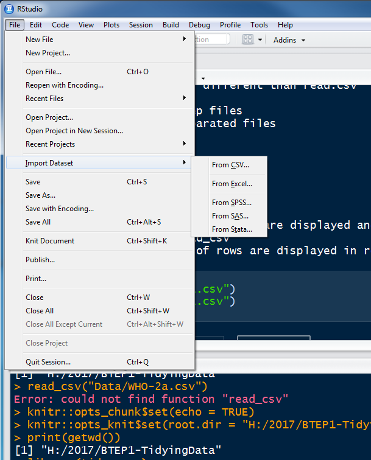
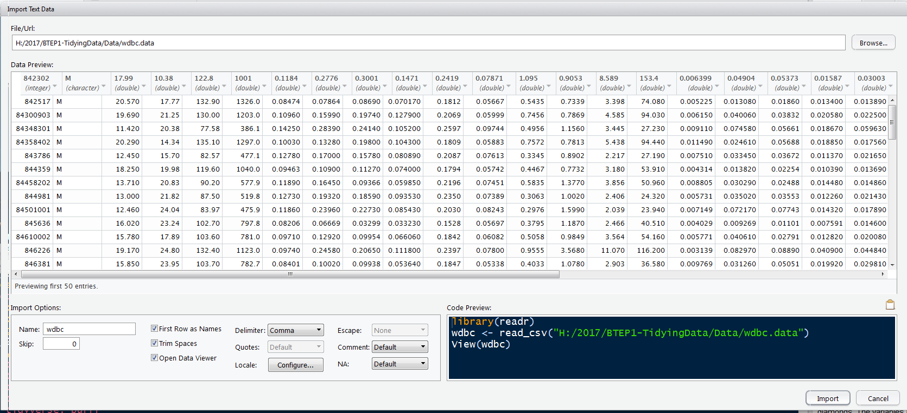

BTEP-R-RStudio-Intro
================
Drs. Sarangan Ravichandran and Randall Johnson
February 26, 2017

Let us first load the libraries

``` r
# if you dont have tidyverse then run the following line once 
# install.packages("tidyverse")
library(tidyverse) 
```

    ## Loading tidyverse: ggplot2
    ## Loading tidyverse: tibble
    ## Loading tidyverse: tidyr
    ## Loading tidyverse: readr
    ## Loading tidyverse: purrr
    ## Loading tidyverse: dplyr

    ## Conflicts with tidy packages ----------------------------------------------

    ## filter(): dplyr, stats
    ## lag():    dplyr, stats

Let us introduce R/R-Studio Data Import with a Import Dataset and Command-line options
--------------------------------------------------------------------------------------



The following few lines will explain how to read in a data file via R command-line

Please note that we will be using **readr** function for this section. Note that read\_csv is different than read.csv

-   read\_csv(), read\_csv2() \# read\_csv2 and read\_csv are same except for what options are default
-   the returning objects from read\_csv and read.csv are different (DF vs tibbles)
-   read\_tsv()
-   read\_delim()

Let us do some examples
-----------------------

Watch out how the column names are displayed and additional information that you get from read\_csv Also note the number of rows are displayed in read\_csv compared to read.csv

``` r
(tcsv <- read.csv("Data/WHO-2a.csv"))  # traditional csv object
```

    ##                             Country X2007.2013 X2007.2013.1
    ## 1                           Bahamas       15.9          2.2
    ## 2  Bolivia (Plurinational State of)        4.5          3.5
    ## 3                            Brazil       11.3           NA
    ## 4                      Burkina Faso        2.9          2.2
    ## 5                           Burundi        2.8          1.7
    ## 6                             China        1.4          1.6
    ## 7                          Colombia        3.1           NA
    ## 8                             Congo       11.5          6.5
    ## 9                      Cook Islands        4.5           NA
    ## 10 Democratic Republic of the Congo        2.3          2.0
    ## 11               Dominican Republic        9.4          1.2
    ## 12                          Ecuador        5.0           NA
    ## 13                      El Salvador       16.4           NA
    ## 14                            Haiti        7.3          4.8
    ## 15                            India       86.3         33.1
    ## 16                        Indonesia        2.0          1.8
    ## 17       Iran (Islamic Republic of)        1.3          1.3
    ## 18                       Kyrgyzstan        3.4           NA
    ## 19                           Malawi        3.9           NA
    ## 20                        Mauritius        5.9           NA
    ## 21                           Mexico        4.7           NA
    ## 22                        Nicaragua        5.7           NA
    ## 23                            Niger        3.9          2.9
    ## 24                             Oman        7.4           NA
    ## 25                             Peru        5.6          1.4
    ## 26                      Philippines       10.8         10.8
    ## 27              Republic of Moldova        4.7          5.2
    ## 28               Russian Federation        4.1          2.7
    ## 29                           Rwanda        3.6          1.7
    ## 30            Sao Tome and Principe       13.8          2.4
    ## 31                          Ukraine        3.7          4.0
    ## 32                           Zambia        4.7           NA

``` r
(ncsv <- read_csv("Data/WHO-2a.csv"))  # new csv, tibble object
```

    ## Warning: Duplicated column names deduplicated: '2007-2013' =>
    ## '2007-2013_1' [3]

    ## Parsed with column specification:
    ## cols(
    ##   Country = col_character(),
    ##   `2007-2013` = col_double(),
    ##   `2007-2013_1` = col_double()
    ## )

    ## # A tibble: 32 × 3
    ##                             Country `2007-2013` `2007-2013_1`
    ##                               <chr>       <dbl>         <dbl>
    ## 1                           Bahamas        15.9           2.2
    ## 2  Bolivia (Plurinational State of)         4.5           3.5
    ## 3                            Brazil        11.3            NA
    ## 4                      Burkina Faso         2.9           2.2
    ## 5                           Burundi         2.8           1.7
    ## 6                             China         1.4           1.6
    ## 7                          Colombia         3.1            NA
    ## 8                             Congo        11.5           6.5
    ## 9                      Cook Islands         4.5            NA
    ## 10 Democratic Republic of the Congo         2.3           2.0
    ## # ... with 22 more rows

See the difference in the returning objects' class

``` r
class(ncsv) # traditional csv function, read.csv 
```

    ## [1] "tbl_df"     "tbl"        "data.frame"

``` r
class(tcsv) # tidyverse read_csv
```

    ## [1] "data.frame"

What happens if your dataset has a metadata (indicated by \# ) as the first line followed by the column names

``` r
read_csv("Data/WHO-2a.csv", comment = "#")
```

    ## Warning: Duplicated column names deduplicated: '2007-2013' =>
    ## '2007-2013_1' [3]

    ## Parsed with column specification:
    ## cols(
    ##   Country = col_character(),
    ##   `2007-2013` = col_double(),
    ##   `2007-2013_1` = col_double()
    ## )

    ## # A tibble: 32 × 3
    ##                             Country `2007-2013` `2007-2013_1`
    ##                               <chr>       <dbl>         <dbl>
    ## 1                           Bahamas        15.9           2.2
    ## 2  Bolivia (Plurinational State of)         4.5           3.5
    ## 3                            Brazil        11.3            NA
    ## 4                      Burkina Faso         2.9           2.2
    ## 5                           Burundi         2.8           1.7
    ## 6                             China         1.4           1.6
    ## 7                          Colombia         3.1            NA
    ## 8                             Congo        11.5           6.5
    ## 9                      Cook Islands         4.5            NA
    ## 10 Democratic Republic of the Congo         2.3           2.0
    ## # ... with 22 more rows

Why we insist on using readr::read\_csv than read.csv?
------------------------------------------------------

-   Speed (~ 10x)
-   output from readr is Tibbles (we talked about earlier)
-   Base R taps into OS where it is executed. But readr functions are OS independent and hence reproducible

Import Exercise-1
-----------------

What function would you use to read a file whose fields are separated by |

To find out where you are, use the getwd command
------------------------------------------------

``` r
getwd()
```

    ## [1] "H:/2017/BTEP1-TidyingData"

you can set a directory to go to by

``` r
setwd("YOUR_DIR"")
```

To get a detailed description of the attached packages and R session
--------------------------------------------------------------------

``` r
sessionInfo()
```

    ## R version 3.3.2 (2016-10-31)
    ## Platform: x86_64-w64-mingw32/x64 (64-bit)
    ## Running under: Windows 7 x64 (build 7601) Service Pack 1
    ## 
    ## locale:
    ## [1] LC_COLLATE=English_United States.1252 
    ## [2] LC_CTYPE=English_United States.1252   
    ## [3] LC_MONETARY=English_United States.1252
    ## [4] LC_NUMERIC=C                          
    ## [5] LC_TIME=English_United States.1252    
    ## 
    ## attached base packages:
    ## [1] stats     graphics  grDevices utils     datasets  methods   base     
    ## 
    ## other attached packages:
    ## [1] dplyr_0.5.0     purrr_0.2.2     readr_1.0.0     tidyr_0.6.1    
    ## [5] tibble_1.2      ggplot2_2.2.1   tidyverse_1.1.1
    ## 
    ## loaded via a namespace (and not attached):
    ##  [1] Rcpp_0.12.8      plyr_1.8.4       forcats_0.2.0    tools_3.3.2     
    ##  [5] digest_0.6.11    jsonlite_1.2     lubridate_1.6.0  evaluate_0.10   
    ##  [9] nlme_3.1-128     gtable_0.2.0     lattice_0.20-34  psych_1.6.12    
    ## [13] DBI_0.5-1        yaml_2.1.14      parallel_3.3.2   haven_1.0.0     
    ## [17] xml2_1.1.0       stringr_1.1.0    httr_1.2.1       knitr_1.15.1    
    ## [21] hms_0.3          rprojroot_1.2    grid_3.3.2       R6_2.2.0        
    ## [25] readxl_0.1.1     foreign_0.8-67   rmarkdown_1.3    modelr_0.1.0    
    ## [29] reshape2_1.4.2   magrittr_1.5     backports_1.0.5  scales_0.4.1    
    ## [33] htmltools_0.3.5  rvest_0.3.2      assertthat_0.1   mnormt_1.5-5    
    ## [37] colorspace_1.3-2 stringi_1.1.2    lazyeval_0.2.0   munsell_0.4.3   
    ## [41] broom_0.4.1

Basic Usage

``` r
summary(cars)
```

    ##      speed           dist       
    ##  Min.   : 4.0   Min.   :  2.00  
    ##  1st Qu.:12.0   1st Qu.: 26.00  
    ##  Median :15.0   Median : 36.00  
    ##  Mean   :15.4   Mean   : 42.98  
    ##  3rd Qu.:19.0   3rd Qu.: 56.00  
    ##  Max.   :25.0   Max.   :120.00

If you want to just display the code chunk but not the concerned R code, you need "echo = FALSE"

    ##      speed           dist       
    ##  Min.   : 4.0   Min.   :  2.00  
    ##  1st Qu.:12.0   1st Qu.: 26.00  
    ##  Median :15.0   Median : 36.00  
    ##  Mean   :15.4   Mean   : 42.98  
    ##  3rd Qu.:19.0   3rd Qu.: 56.00  
    ##  Max.   :25.0   Max.   :120.00

Plotting in Rmd. If you want the users to see the plot but not the code, then do the following:

Note the eval=FALSE (upper case; lower case will fail) 

If you want to display the R code without evualating, then use

``` r
summary(cars)
```

What about additional formating when displaying the contens of a table? Note the **asis** option

``` r
knitr::kable(mtcars)
```

|                     |   mpg|  cyl|   disp|   hp|  drat|     wt|   qsec|   vs|   am|  gear|  carb|
|---------------------|-----:|----:|------:|----:|-----:|------:|------:|----:|----:|-----:|-----:|
| Mazda RX4           |  21.0|    6|  160.0|  110|  3.90|  2.620|  16.46|    0|    1|     4|     4|
| Mazda RX4 Wag       |  21.0|    6|  160.0|  110|  3.90|  2.875|  17.02|    0|    1|     4|     4|
| Datsun 710          |  22.8|    4|  108.0|   93|  3.85|  2.320|  18.61|    1|    1|     4|     1|
| Hornet 4 Drive      |  21.4|    6|  258.0|  110|  3.08|  3.215|  19.44|    1|    0|     3|     1|
| Hornet Sportabout   |  18.7|    8|  360.0|  175|  3.15|  3.440|  17.02|    0|    0|     3|     2|
| Valiant             |  18.1|    6|  225.0|  105|  2.76|  3.460|  20.22|    1|    0|     3|     1|
| Duster 360          |  14.3|    8|  360.0|  245|  3.21|  3.570|  15.84|    0|    0|     3|     4|
| Merc 240D           |  24.4|    4|  146.7|   62|  3.69|  3.190|  20.00|    1|    0|     4|     2|
| Merc 230            |  22.8|    4|  140.8|   95|  3.92|  3.150|  22.90|    1|    0|     4|     2|
| Merc 280            |  19.2|    6|  167.6|  123|  3.92|  3.440|  18.30|    1|    0|     4|     4|
| Merc 280C           |  17.8|    6|  167.6|  123|  3.92|  3.440|  18.90|    1|    0|     4|     4|
| Merc 450SE          |  16.4|    8|  275.8|  180|  3.07|  4.070|  17.40|    0|    0|     3|     3|
| Merc 450SL          |  17.3|    8|  275.8|  180|  3.07|  3.730|  17.60|    0|    0|     3|     3|
| Merc 450SLC         |  15.2|    8|  275.8|  180|  3.07|  3.780|  18.00|    0|    0|     3|     3|
| Cadillac Fleetwood  |  10.4|    8|  472.0|  205|  2.93|  5.250|  17.98|    0|    0|     3|     4|
| Lincoln Continental |  10.4|    8|  460.0|  215|  3.00|  5.424|  17.82|    0|    0|     3|     4|
| Chrysler Imperial   |  14.7|    8|  440.0|  230|  3.23|  5.345|  17.42|    0|    0|     3|     4|
| Fiat 128            |  32.4|    4|   78.7|   66|  4.08|  2.200|  19.47|    1|    1|     4|     1|
| Honda Civic         |  30.4|    4|   75.7|   52|  4.93|  1.615|  18.52|    1|    1|     4|     2|
| Toyota Corolla      |  33.9|    4|   71.1|   65|  4.22|  1.835|  19.90|    1|    1|     4|     1|
| Toyota Corona       |  21.5|    4|  120.1|   97|  3.70|  2.465|  20.01|    1|    0|     3|     1|
| Dodge Challenger    |  15.5|    8|  318.0|  150|  2.76|  3.520|  16.87|    0|    0|     3|     2|
| AMC Javelin         |  15.2|    8|  304.0|  150|  3.15|  3.435|  17.30|    0|    0|     3|     2|
| Camaro Z28          |  13.3|    8|  350.0|  245|  3.73|  3.840|  15.41|    0|    0|     3|     4|
| Pontiac Firebird    |  19.2|    8|  400.0|  175|  3.08|  3.845|  17.05|    0|    0|     3|     2|
| Fiat X1-9           |  27.3|    4|   79.0|   66|  4.08|  1.935|  18.90|    1|    1|     4|     1|
| Porsche 914-2       |  26.0|    4|  120.3|   91|  4.43|  2.140|  16.70|    0|    1|     5|     2|
| Lotus Europa        |  30.4|    4|   95.1|  113|  3.77|  1.513|  16.90|    1|    1|     5|     2|
| Ford Pantera L      |  15.8|    8|  351.0|  264|  4.22|  3.170|  14.50|    0|    1|     5|     4|
| Ferrari Dino        |  19.7|    6|  145.0|  175|  3.62|  2.770|  15.50|    0|    1|     5|     6|
| Maserati Bora       |  15.0|    8|  301.0|  335|  3.54|  3.570|  14.60|    0|    1|     5|     8|
| Volvo 142E          |  21.4|    4|  121.0|  109|  4.11|  2.780|  18.60|    1|    1|     4|     2|

In the tidyverse the commonly returning objects are not data.frame but tibbles. So, let us introduce tibble in the next section

Tibble
------

What is tibble?

-   modern way or loooking at the traditional data.frame
-   you will get a lot more useful information than the data.frames
-   tibble is part of tibble package and part of the core tidyverse package

To get help, use

``` r
?tibble
vignette("tibble")
```

How to create a tibble?

``` r
tibble(
  x = 1:5, 
  y = LETTERS[1:5], 
  z = x^2 + 20
)
```

    ## # A tibble: 5 × 3
    ##       x     y     z
    ##   <int> <chr> <dbl>
    ## 1     1     A    21
    ## 2     2     B    24
    ## 3     3     C    29
    ## 4     4     D    36
    ## 5     5     E    45

What is the difference between the R regular data.frame and tibble (data\_frame)?

``` r
employee <- c('John Wayne','Peter Doe','Esther Julie')
salary <- c(20000, 23400, 26800)
startdate <- as.Date(c('2016-12-1','2007-3-25','2016-3-14'))
df <- data.frame(employee, salary, startdate)
df
```

    ##       employee salary  startdate
    ## 1   John Wayne  20000 2016-12-01
    ## 2    Peter Doe  23400 2007-03-25
    ## 3 Esther Julie  26800 2016-03-14

``` r
as_tibble(df)
```

    ## # A tibble: 3 × 3
    ##       employee salary  startdate
    ##         <fctr>  <dbl>     <date>
    ## 1   John Wayne  20000 2016-12-01
    ## 2    Peter Doe  23400 2007-03-25
    ## 3 Esther Julie  26800 2016-03-14

you can coerce regular R data frame into tibble. Let us look at the R dataset, cars. Let us learn about cars datset

<pre> <code>
  ?cars
</code></pre>
Let us find out what class cars object belongs to and how to convert cars data frame into tibbles object. Note that

``` r
class(cars)
```

    ## [1] "data.frame"

``` r
as_tibble(cars)
```

    ## # A tibble: 50 × 2
    ##    speed  dist
    ##    <dbl> <dbl>
    ## 1      4     2
    ## 2      4    10
    ## 3      7     4
    ## 4      7    22
    ## 5      8    16
    ## 6      9    10
    ## 7     10    18
    ## 8     10    26
    ## 9     10    34
    ## 10    11    17
    ## # ... with 40 more rows

``` r
head(cars) #otherwise you get all 50 rows
```

    ##   speed dist
    ## 1     4    2
    ## 2     4   10
    ## 3     7    4
    ## 4     7   22
    ## 5     8   16
    ## 6     9   10

Why Tibble?
-----------

-   Tibble doesnt change the inputs. Ex. strings to factors
-   Doesnt add new names or modify the inputs
-   For example, Tibble never converts strings to factors

What is tribble
---------------

-   transposed tibble, tribble()
-   small data in readable form
-   column headings are shown as formulas ( ie ~ )
-   nice format
-   no need to explicitely use head command (Ex. head cars)

``` r
tribble(
  ~x, ~y, ~z,
  #--|--|----
  "Male", 187, 210,
  "Female", 190, 150
)
```

    ## # A tibble: 2 × 3
    ##        x     y     z
    ##    <chr> <dbl> <dbl>
    ## 1   Male   187   210
    ## 2 Female   190   150

Let us create a little bit complicated tibble note that lubridate gives the current time

``` r
t2 <- tibble(
  a = lubridate::now() + runif(1e3) * 86400,
  b = lubridate::today() + runif(1e3) * 30,
  c = 1:1e3,
  d = runif(1e3),
  e = sample(letters, 1e3, replace = TRUE)
)
```

``` r
t2
```

    ## # A tibble: 1,000 × 5
    ##                      a          b     c          d     e
    ##                 <dttm>     <date> <int>      <dbl> <chr>
    ## 1  2017-03-06 17:20:29 2017-03-14     1 0.91034187     y
    ## 2  2017-03-07 10:21:39 2017-03-25     2 0.82095422     g
    ## 3  2017-03-06 14:44:32 2017-03-12     3 0.06081037     d
    ## 4  2017-03-06 21:47:59 2017-03-28     4 0.03439176     y
    ## 5  2017-03-06 16:05:09 2017-03-28     5 0.26221651     q
    ## 6  2017-03-07 06:11:50 2017-03-12     6 0.64396679     p
    ## 7  2017-03-07 01:10:55 2017-03-23     7 0.41838772     u
    ## 8  2017-03-06 13:16:22 2017-03-07     8 0.56141784     v
    ## 9  2017-03-07 04:12:33 2017-03-27     9 0.54040962     v
    ## 10 2017-03-06 13:42:40 2017-03-28    10 0.29763663     y
    ## # ... with 990 more rows

You can change the defaults of tibble display with options.

``` r
options(tibble.print_max = 10, tibble.print_min = 6)
t2
```

    ## # A tibble: 1,000 × 5
    ##                     a          b     c          d     e
    ##                <dttm>     <date> <int>      <dbl> <chr>
    ## 1 2017-03-06 17:20:29 2017-03-14     1 0.91034187     y
    ## 2 2017-03-07 10:21:39 2017-03-25     2 0.82095422     g
    ## 3 2017-03-06 14:44:32 2017-03-12     3 0.06081037     d
    ## 4 2017-03-06 21:47:59 2017-03-28     4 0.03439176     y
    ## 5 2017-03-06 16:05:09 2017-03-28     5 0.26221651     q
    ## 6 2017-03-07 06:11:50 2017-03-12     6 0.64396679     p
    ## # ... with 994 more rows

You can also use the following tibble option to show all columns

``` r
options(tibble.width = Inf)
# more options available at 
package?tibble
```

How to extract the columns or rows of tibble?

``` r
head(t2$a)
```

    ## [1] "2017-03-06 17:20:29 EST" "2017-03-07 10:21:39 EST"
    ## [3] "2017-03-06 14:44:32 EST" "2017-03-06 21:47:59 EST"
    ## [5] "2017-03-06 16:05:09 EST" "2017-03-07 06:11:50 EST"

``` r
has_name(t2, "b")
```

    ## [1] TRUE

``` r
getOption("tibble.max_extra_cols")
```

    ## NULL

how to add a row of a tibble in a specific place?

original t2

``` r
t2
```

    ## # A tibble: 1,000 × 5
    ##                     a          b     c          d     e
    ##                <dttm>     <date> <int>      <dbl> <chr>
    ## 1 2017-03-06 17:20:29 2017-03-14     1 0.91034187     y
    ## 2 2017-03-07 10:21:39 2017-03-25     2 0.82095422     g
    ## 3 2017-03-06 14:44:32 2017-03-12     3 0.06081037     d
    ## 4 2017-03-06 21:47:59 2017-03-28     4 0.03439176     y
    ## 5 2017-03-06 16:05:09 2017-03-28     5 0.26221651     q
    ## 6 2017-03-07 06:11:50 2017-03-12     6 0.64396679     p
    ## # ... with 994 more rows

``` r
    aa = lubridate::today()
    bb = lubridate::now()
    cc = 1:1
    dd = runif(1)
    ee = sample(letters, 1, replace = TRUE)
    print(aa); print(bb); print(cc); print(dd); print(ee)
```

    ## [1] "2017-03-06"

    ## [1] "2017-03-06 10:32:53 EST"

    ## [1] 1

    ## [1] 0.9267156

    ## [1] "d"

``` r
t2 %>% 
  add_row(
    a = aa, 
    b = bb,
    c = cc,
    d = dd,
    e = ee, .before = 2  # note the dot in ".before = 2"
)
```

    ## # A tibble: 1,001 × 5
    ##                     a          b     c          d     e
    ##                <dttm>     <date> <int>      <dbl> <chr>
    ## 1 2017-03-06 17:20:29 2017-03-14     1 0.91034187     y
    ## 2 2017-03-05 19:00:00 2017-03-06     1 0.92671561     d
    ## 3 2017-03-07 10:21:39 2017-03-25     2 0.82095422     g
    ## 4 2017-03-06 14:44:32 2017-03-12     3 0.06081037     d
    ## 5 2017-03-06 21:47:59 2017-03-28     4 0.03439176     y
    ## 6 2017-03-06 16:05:09 2017-03-28     5 0.26221651     q
    ## # ... with 995 more rows

After the change

``` r
t2
```

    ## # A tibble: 1,000 × 5
    ##                     a          b     c          d     e
    ##                <dttm>     <date> <int>      <dbl> <chr>
    ## 1 2017-03-06 17:20:29 2017-03-14     1 0.91034187     y
    ## 2 2017-03-07 10:21:39 2017-03-25     2 0.82095422     g
    ## 3 2017-03-06 14:44:32 2017-03-12     3 0.06081037     d
    ## 4 2017-03-06 21:47:59 2017-03-28     4 0.03439176     y
    ## 5 2017-03-06 16:05:09 2017-03-28     5 0.26221651     q
    ## 6 2017-03-07 06:11:50 2017-03-12     6 0.64396679     p
    ## # ... with 994 more rows

Subsetting
----------

-   $ by name
-   

``` r
df <- tibble(
  x = runif(5),
  y = rnorm(5)
)

df$x
```

    ## [1] 0.7481171 0.9716237 0.5388791 0.7087651 0.9401897

``` r
df[[1]]
```

    ## [1] 0.7481171 0.9716237 0.5388791 0.7087651 0.9401897

Can you use Tibble in a pipeline?

``` r
df %>% .$x   
```

    ## [1] 0.7481171 0.9716237 0.5388791 0.7087651 0.9401897

``` r
df %>% .[["y"]]
```

    ## [1] -0.13700007  1.03485399 -0.36850566 -0.40163757  0.03615211

What happens if tibble doesnt work with a package? Transform Tibble back to a data.frame using the following command:

``` r
as.data.frame(df)
```

    ##           x           y
    ## 1 0.7481171 -0.13700007
    ## 2 0.9716237  1.03485399
    ## 3 0.5388791 -0.36850566
    ## 4 0.7087651 -0.40163757
    ## 5 0.9401897  0.03615211

Including Plots
---------------

You can also embed plots, for example:


Note that the `echo = FALSE` parameter was added to the code chunk to prevent printing of the R code that generated the plot.

``` r
with(cars, plot(speed,dist))
```


Tibble Exercise 1
-----------------

Create a new tibble with the following information: name, age, height, weight, smoker (T or F), Male (True or Fale) compare the tibble with the R data\_frame

Exercise 2
----------

convert iris data set (given to us in data.frame ) to tibble data\_frame

Exercise 3
----------

How can you tell whether the object is a Tibble or not?

Exercise 4 (based on Wickam's book)
-----------------------------------

Partial matching is a big issue with data.frame. df &lt;- data.frame(abc = 1, xyz = "a") df$x df\[, "xyz"\]

Base R and Packages
===================

cran.r-project.org
==================

Base R and R core packages can be downloaded from
=================================================

Comprehensive R Archive Network (CRAN)
======================================

Available in Windows/Linux/Mac0
===============================

How to interact with R?
=======================

RGUI Deducer (preferred for the class) or RStudio
=================================================

Editor for R coding vi (linux) or vim or Emacs
==============================================

Key packages:
=============

foreign (to read other software files such as Stata)
====================================================

xlsk
====

XLConnect \# for xls files
==========================

install.packages("foreign") \# to install foreign package require(foreign) \# to load foreign package \#or library(foreign) help(package=foreign)

to get a detailed description of the attached packages and R session
====================================================================

sessionInfo()

R commands can be either typed or loaded from a file
====================================================

using source command
====================

case sensitive
==============

getwd() Getwd() \# correct command is getwd()

setwd("c:") getwd() \# to check

list.files() \# lists all files in the directory

everything is an vector object in R
===================================

create a series of numbers using command line in R
==================================================

xx&lt;-scan() 1 2 3 4 5 7 8 9 10 \# end with an empty space

getting help
============

?help ?scan

another way to create a vector
==============================

Variable names no number, no underscore etc.
============================================

ages&lt;-c(1,2,3,4) ages

ages+3 \# ages of kids after 3 years

age&lt;-3 \# scalar is a zero vector age age +3

age = 3 \# same as age&lt;-3

don't mix numbers and character in a vector
===========================================

x&lt;-c("Brazil","Argentina","India")

try mixing it with numbers
==========================

x&lt;-c("Brazil",10, "India")

How to mix the character data and numerical data?
=================================================

Country&lt;-c("USA","Argentina","Mexico") PerCapitaIncome&lt;-c( 51749,11573, 9749) Data&lt;-data.frame(Country,PerCapitaIncome) States&lt;-c(50, 23,31) Data1&lt;-cbind(Data,States)

Country&lt;-c("India") PerCapitaIncome&lt;-c(1450) States&lt;-c(28) Ndata&lt;-data.frame(Country,PerCapitaIncome,States) FinData&lt;-rbind(Data1,Ndata)

IndiaSubset&lt;-subset(FinData,Country == "India") \#Write to a file write.csv(IndiaSubset,"IndiaSubset.csv")

what happens; This is called coercing ; Not good.
=================================================

new\_age&lt;- age+3

to list all objects created in R up to this point
=================================================

ls()

How to input data?
==================

CSV (most common) but other types can be loaded
===============================================

read.csv("test.csv") CSVdat&lt;-read.csv("test.csv") CSVdat

str(CSVdat) \# str function summary(CSVdat)

how to read xls file?
=====================

????ADD
=======

can also read binary files
==========================

?readBin
========

What do you do with the data?
=============================

head(CSVdat) tail(CSVdat)

colnames(CSVdat) names(CSVdat) \# same as colnames dim(CSVdat) \#dimension of the data class(CSVdat) summary(CSVdat)

View(csv-dat) \# to edit the data

R reads the datta and stores the data as data frames
====================================================

Which have the format like matrix
=================================

To extract or address a variables
=================================

object\[row,column\]
====================

CSVdat\[1,2\]

CSVdat\[ ,2\] \# note the levels have already beeb \# populated CSVdat\[2, \]

CSVdat$ID

dim(CSVdat) \# dimention 5,3 \#Conditional statements \# CSVdat*I**D*\[*C**S**V**d**a**t*ID&gt;=3\] subset(CSVdat, ID&gt;=3) \# to carve out data with ID&gt;=3

Concatenation
=============

sorting
=======

CSVdat1&lt;-read.csv("csv-data1.csv") CSVdat1\[order(CSVdat1$ID), \] \# attach(CSVdat1) ID \# what are the problems in attaching?

sort one column
===============

CSVdat1\[order(AGE), \]

let us sort by two variables one after another
==============================================

CSVdat1\[order(STATEID,AGE), \]

why not reverse?
================

CSVdat1\[order(STATEID,-AGE), \]

data types
==========

INF&lt;-3/0 \# Inf or -Inf -3/0

diff between Inf and NA (not a number)
======================================

!is.na(Inf)

what is then Inf?
=================

is.finite(INF) is.infinite(INF)

x&lt;-c(1,2,3,4) x length(x) min(x) max(x)

x\[1\] x\[2:3\]

x&lt;-seq(1:10)

descriptive Stats
=================

summary(data)

Finally Cleaning up
===================

objects() \# what vars do you have in your env

search() \#what is attached

to remove, use rm(object)
=========================

detach(dataframe)

coercion
========

x&lt;-seq(1:10) x sum(x) \# 55 sum(x&gt;5) \# 5 \#why? coercion x&gt;5 \# logical T or F \# this will be most cases coerced to numeric 0 or 1 \# (F F F F F T T T T T) \# (0 0 0 0 0 1 1 1 1 1) \# sum them sum(x&gt;5) \# you get 5 sum of 5 1s if you want the sum of their values

sum(x\[x&gt;5\])

tapply
======

tapply(X, FactorVar, function)
==============================

tapply(WHO*O**v**e**r*60, *W**H**O*Region, mean)

Hands-on exercise using Wisconsin Breast Cancer dataset
-------------------------------------------------------

Now, let us read a slightly complicated Breast Cancer dataset. First let us use the import data set drop-down option

 

``` r
#wdbc <- read_csv("C:/Users/Ravi/Desktop/BTEP/Data/wdbc.data", col_names = FALSE)

wdbc <- read_csv("Data/wdbc.data", col_names = FALSE)
```

    ## Parsed with column specification:
    ## cols(
    ##   .default = col_double(),
    ##   X1 = col_integer(),
    ##   X2 = col_character()
    ## )

    ## See spec(...) for full column specifications.

``` r
#wdbctry2 <- read_csv("C:/Users/Ravi/Desktop/BTEP/Data/wdbc.data", header = FALSE)
names(wdbc)
```

    ##  [1] "X1"  "X2"  "X3"  "X4"  "X5"  "X6"  "X7"  "X8"  "X9"  "X10" "X11"
    ## [12] "X12" "X13" "X14" "X15" "X16" "X17" "X18" "X19" "X20" "X21" "X22"
    ## [23] "X23" "X24" "X25" "X26" "X27" "X28" "X29" "X30" "X31" "X32"

Let us add column names

``` r
cnames <- c("ID", "Diagnosis", 
            "radius", "Texture", "Perimeter", "area",
            "smoothness", "compactness", "concavity", "concave_points",
            "symmetry","fractaldim",
            "radiusSE", "TextureSE", "PerimeterSE", "areaSE",
            "smoothnessSE", "compactnessSE", "concavitySE", "concave_pointsSE",
            "symmetrySE","fractaldimSE",
            "radiusW", "TextureW", "PerimeterW", "areaW",
            "smoothnessW", "compactnessW", "concavityW", "concave_pointsW",
            "symmetryW","fractaldimW")

names(wdbc) <- cnames
```

Let us find out how many samples we have in the dataset?

``` r
nrow(wdbc)
```

    ## [1] 569

How many covariates are in the dataset? We can look at the Global environment (top right) window to get the information We can also find that out by typing the following command:

``` r
ncol(wdbc)
```

    ## [1] 32
