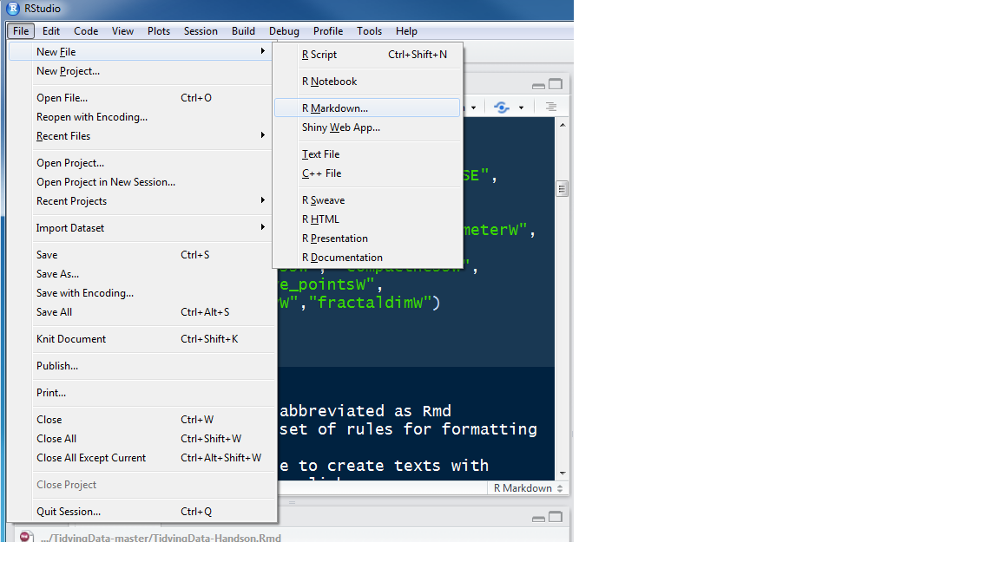
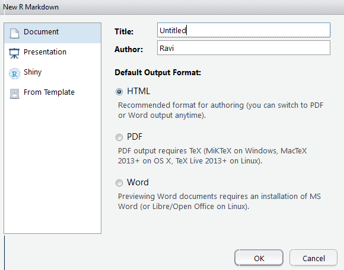
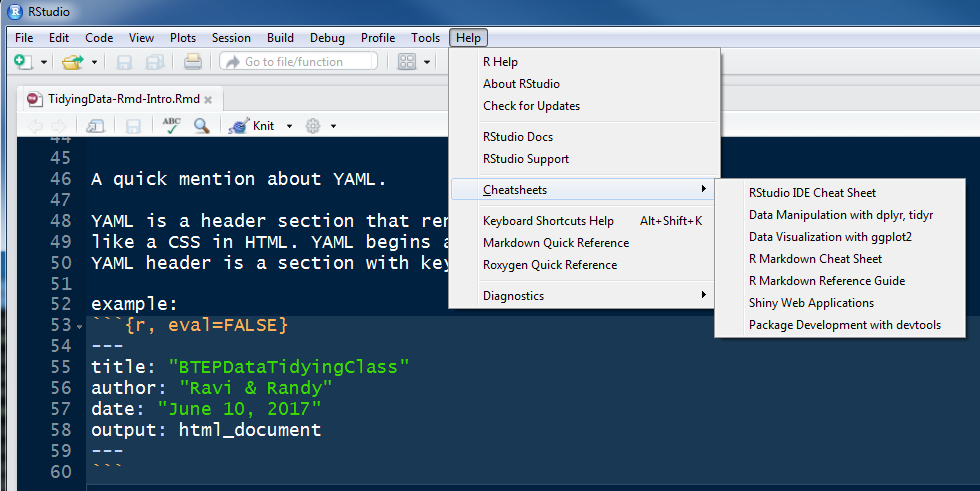
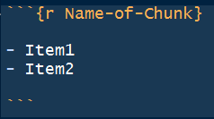
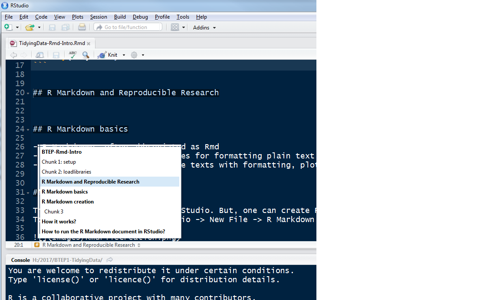

```{r setup, echo = FALSE}
knitr::opts_chunk$set(echo = FALSE)
knitr::opts_knit$set(root.dir = "H:/2017/BTEP1-TidyingData")
print(getwd())
```

Let us load the libraries
```{r loadlibraries}
library(tidyverse) 
```


## R Markdown and Reproducible Research


## R Markdown basics

- R Markdowwn, often abbreviated as Rmd 
- Like HTML, it is a set of rules for formatting plain text,
- You can use Rmd file to create texts with formatting, plots, hypoelinks
  etc. 
  
## R Markdown creation

This section will be based on RStudio. But, one can create Rmd file manually.
To create a template use, RStudio -> New File -> R Markdown 



A window will pop-up asking you to choose the Title and Author and other information (see below)




You can also read in your previously created Rmd file. 


A quick mention about YAML. 

YAML is a header section that renders your .Rmd file. It is almost
like a CSS in HTML. YAML begins and ends with --- tags.
YAML header is a section with key:Value pairs 

example: 
```{r, eval=FALSE}
---
title: "BTEPDataTidyingClass"
author: "Ravi & Randy"
date: "June 10, 2017"
output: html_document
---
```

Rmd format help is available within RStudio. You can find the CheatSheets here,




To use R Markdown, you need a package called rmardown. RStudio installs it automatically when you need them. 


## How it works? 

* When you click **Knit**, R runs the **Rmd code** using **knitr** to produces an **md** file
* **Pandoc** converts the **md** file into the final document (ie pdf, html)
* Note that the output PDF requires you to install LaTeX 
    * For Windows OS, MiKTeX ( <https://miktex.org> ) provides an up-to-date implementation of 
      TeX/LaTeX 


## How to run the R Markdown document in RStudio?

* To effectively use Rmd file, you need to insert what is called *chunk* 
    * use Cmd (Mac)/Ctrl-Alt-I (Windows) to create a chunk
* Here is an example 




* To run a Chunk (the code associated with the chunk), look at the drop-down from the 
  bottom-left, **RMarkdown and Reproducible Resarch** dropdown (see the image below)
  
  
  
  
* There are several Chunk options (ex. eval = FALSE ) can modify the execution of the 
  R code present in the chunk. Please refer to the RMarkdown manual for details.
  

## Table 

* Rmd files can provide a nice Table layout.

```{r}
knitr::kable(
  diamonds[1:4, ], 
  caption = "Example of knitr kable"
)
```

Compare this to the traditional table 

```{r}
diamonds[1:5,]
```

# Global Options

You can set global optons for knitr at the top of the Rmd document. 

<pre> <code>
  knitr::opts_chunk$set( 
    echo = FALSE 
  ) 
</code></pre>

Finally, a brief mention about inline codes. 

Explore the following code with inline R option that produces the following output: 

<pre> <code>
Diamonds package in ggplot2 contains the prices of 60K round cut diamonds. 
Dataset contains information about `r nrow(diamonds)` diamonds.  
</code></pre>


Diamonds package in ggplot2 contains the prices of 60K round cut diamonds. 
Dataset contains information about `r nrow(diamonds)` diamonds.  
  
  